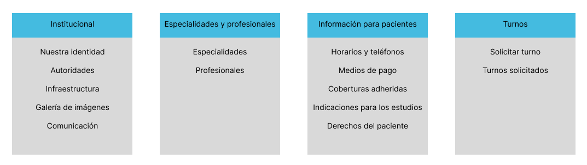

# unlu-paw

Trabajos prácticos de la asignatura "Programación en Ambiente Web" de la Universidad Nacional de Luján.

## Introducción

A lo largo de todos los trabajos prácticos se construirá la web de una institución de salud, que permite a los pacientes conocer las especialidades del lugar y solicitar turnos.

## Esquema de versionado

Los trabajos prácticos se encuentran divididos en 5 enunciados que van incrementando la funcionalidad y la estética del sitio web. Se generarán versiones de este proyecto a medida que se vayan completando los enunciados, conforme a la siguiente tabla:

| Enunciado                  | Versión  | Entregado |
|:--------------------------:|:--------:|:---------:|
| [TP 1](enunciados/tp1.pdf) | `v0.1.x` | -         |
| [TP 2](enunciados/tp2.pdf) | `v0.2.x` | -         |
| [TP 3](enunciados/tp3.pdf) | `v0.3.x` | -         |
| [TP 4](enunciados/tp4.pdf) | `v0.4.x` | -         |
| [TP 5](enunciados/tp5.pdf) | `v1.0.x` | -         |

## Diseño

### Mapa del sitio

### Wireframes

[Link al Figma](https://www.figma.com/design/z7gvCERG3qwI8cQ2rNJfJe/unlu-paw?node-id=0-1&t=DjNWNwiLrSGaraYQ-1)

## Consideraciones

* En el formulario de solicitud de turno no se incluirá el campo para la edad (solicitado en el [TP 1](enunciados/tp1.pdf)) dado que es un valor calculado a partir de la fecha de nacimiento y la fecha actual (obtenida del servidor web).
